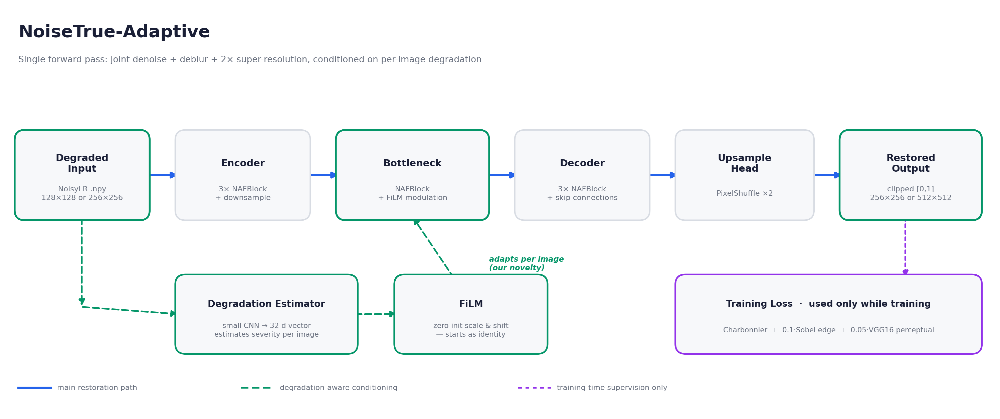

# NoiseTrue-Adaptive

**Finding the true signal under the noise — with degradation-aware adaptivity.**

Submission for SEMICON India Hackathon 2026, KLA Track — *AI-Based Restoration of
Degraded Images for Semiconductor Inspection*.

**[Demo Video](https://youtu.be/GsRu_q6-TAo)** | **[Solution Deck (PDF)](https://drive.google.com/file/d/1EAIBYGKRnK-0wlb35GZI8O3Y14XANPHX/view?usp=sharing)** | **[Solution Deck (PPTX)](https://docs.google.com/presentation/d/1_WtXxRmzj7e2SBih-oGFq3mKN2llAlTT/edit?usp=sharing)**

---

## Problem

Inspection images arrive degraded three ways at once: speckle noise (multiplicative,
and it pushes pixel values outside the true intensity range), additive Gaussian noise
(soft, hazy edges), and 2× spatial downsampling (fine detail genuinely lost). Any
combination and strength may be present in a single image. The restored output is
scored on PSNR, SSIM and LPIPS against hidden ground truth, on both in-distribution
and out-of-distribution content, with end-to-end throughput also benchmarked.

## Pipeline



A NAFNet-lite encoder–decoder performs joint denoising, deblurring and 2× super-resolution
in a **single forward pass**, ending in a PixelShuffle upsample head. Each NAFBlock uses
LayerNorm, a depthwise convolution, SimpleGate in place of a nonlinear activation, and
simplified channel attention.

On top of that sits the project's novelty: a small **degradation estimator** reads each
degraded input and emits a 32-dimensional vector describing how damaged that specific
image is. A **zero-initialised FiLM layer** turns that vector into a per-channel scale and
shift applied at the bottleneck, so the network adapts its processing per image rather
than applying one fixed strategy to everything. Because FiLM starts as an exact identity,
training begins equivalent to the plain baseline and can only deviate where doing so
measurably lowers the loss.

Training loss is Charbonnier (robust to the outlier pixels speckle produces) + 0.1 × Sobel
edge loss (penalises smeared edges directly) + 0.05 × VGG16 perceptual loss (targets the
same feature-space notion of similarity that LPIPS measures). **No adversarial loss is used
anywhere, deliberately** — GAN-style training invents plausible texture, which is exactly
the ringing and artificial patterning the problem statement warns against.

## Results

Ablation study on the held-out validation split (320 pairs, seed-42 split, never trained on):

| Model | PSNR (dB) ↑ | SSIM ↑ | LPIPS ↓ | ms/img | Params |
|---|---|---|---|---|---|
| U-Net baseline | 28.236 | 0.7649 | 0.2572 | 4.82 | 1.96 M |
| U-Net + FiLM | 28.411 | 0.7662 | 0.2670 | 3.30 | 1.99 M |
| NAFNet-lite baseline | 28.295 | 0.7651 | 0.2354 | 7.79 | 1.21 M |
| NAFNet-lite + FiLM | 28.332 | 0.7666 | 0.2326 | 8.40 | 1.23 M |
| **FINAL — wide NAFNet-lite + FiLM + VGG loss** | **28.546** | **0.7682** | **0.1938** | 10.04 | 2.73 M |

The final model wins on all three official metrics. The largest gain is LPIPS
(17% better than the next-best model), consistent with adding a perceptual loss term that
directly targets perceptual similarity.

**End-to-end throughput: 6.50 ms/image**, measured across all 3200 provided images on a
T4 GPU, including disk reads, preprocessing, model execution, clipping and saving —
the full pipeline, not just the forward pass. Expected to be faster still on the H100
used for evaluation.

Notes on the ablation: FiLM with default random initialisation initially *lost* to the
baseline on every metric. Diagnosing that (the randomly-initialised modulation distorts
bottleneck features from step one, and training spends its budget recovering rather than
learning) and switching to zero-initialisation is what turned the idea into a measurable
gain. FiLM then improved results on both backbones independently.

## Visual results

**U-Net+FiLM vs NAFNet+FiLM** — noisy input, both models' outputs, and ground truth,
side by side:


*Dense periodic grid structure — the final architecture recovers the lattice lines the U-Net smears.*


*Fold and edge detail — sharper, closer to ground truth, no ringing artifacts.*

More examples are in `results/sample_outputs/`.

---

## Repository structure

```
README.md
LICENSE.md
requirements.txt
train.py                     reproduces the submitted checkpoint
run.py                       official entry point: python run.py <input-dir> <output-dir>
configs/
  final_model_config.yaml    every hyperparameter of the final run
src/
  model.py                   U-Net baseline + U-Net with FiLM
  model_nafnet.py            NAFBlock, NAFNet-lite, FiLM, final model
  dataset_and_losses.py      paired .npy dataset, Charbonnier + Sobel losses
  dataset_augmented.py       dataset with flip augmentation
  advanced_loss.py           VGG16 perceptual loss + combined loss
  train_ablations.py         reproduces the four ablation checkpoints
models/
  final_model.pth            SUBMITTED checkpoint -- use this one
  baseline_models/           the four ablation checkpoints (not submitted, kept for reproducibility)
results/
  pipeline_diagram_clean.png architecture diagram (shown above)
  results_composite.png      full metrics table + visual comparisons
  sample_outputs/            per-image before/after comparisons
solution_presentation.pptx  (also hosted on Google Drive -- see link at top of this README)
```

## Setup

```bash
pip install -r requirements.txt
```

## Running inference

```bash
python run.py <input-dir> <output-dir>
```

This is the official, self-contained entry point — the model architecture is defined
directly inside `run.py`, so it has no dependency on the `src/` folder. Detects and uses
a GPU automatically, falls back to CPU otherwise. Weights load from
`models/final_model.pth` by default; override with `--model_path`. Images sharing a shape
are batched together (`--batch_size`, default 16). Outputs are clipped to [0,1] and
sanitised of any NaN/Inf values before saving, since the evaluator scores files exactly
as written. **No internet access, API keys, or manual source-code edits are required.**

Example:
```bash
python run.py ./test_inputs ./test_outputs
```

## Reproducing training

```bash
# final submitted model
python train.py --gt_dir <path/to/GT> --noisy_dir <path/to/NoisyLR>

# the four ablation models
python src/train_ablations.py --gt_dir <path/to/GT> --noisy_dir <path/to/NoisyLR>
```

## Reproducing the metrics

```bash
python evaluate.py --gt_dir <path/to/GT> --noisy_dir <path/to/NoisyLR>
```

Reports PSNR, SSIM, LPIPS, per-image time and parameter count for the final model
(`models/final_model.pth`) and, if present, the four ablation checkpoints in
`models/baseline_models/`. Missing checkpoints are skipped rather than causing a
failure, so this runs with just the final model if that is all that is present.

## Input / output contract

- **Input:** `.npy` files, float32, single channel, 128×128 or 256×256. Values may fall
  outside [0,1]; they are loaded as-is and never clipped on input, since that
  out-of-range signal is real information from the speckle process.
- **Output:** `.npy` files, float32, single channel, shape `(H, W)`, exactly 2× the input
  resolution (256×256 or 512×512), clipped to [0,1] with no NaN/Inf, written to
  `<output-dir>` under the **same filename** as the corresponding input.

## Experiment configuration

Adam, lr 1e-3 with cosine annealing, batch size 16, 80 epochs, horizontal and vertical
flip augmentation, 90/10 train/validation split fixed by seed 42. The checkpoint saved is
the one with the lowest validation loss, not the last epoch. Full detail in
`configs/final_model_config.yaml`.

Hardware: trained on a single free-tier Google Colab T4. The complete five-model
programme fits in a few GPU-hours.

## External resources

| Resource | Use | Licence |
|---|---|---|
| [torchvision](https://github.com/pytorch/vision) VGG16, ImageNet weights | Perceptual loss during training only — not part of the model at inference | BSD-3-Clause |
| [`lpips`](https://github.com/richzhang/PerceptualSimilarity) (Zhang et al., 2018) | Evaluation metric only — not part of the model or training loss | BSD-2-Clause |
| [scikit-image](https://scikit-image.org/) | PSNR and SSIM computation | BSD-3-Clause |
| KLA paired GT / NoisyLR training set | Training and validation data | Provided by organisers |

No other external datasets or pretrained weights were used.

## Limitations

- Validation is on a random 10% split of the provided training data. It shares the
  provided set's degradation characteristics, so it measures in-distribution performance;
  true out-of-distribution behaviour on the organisers' hidden test content is not
  something we can verify from here.
- FiLM conditioning was tested at a single hyperparameter configuration (32-d conditioning
  vector, injected at the bottleneck). Conditioning dimensionality and injection point were
  not swept, so the reported gain is a lower bound rather than a tuned optimum.
- Reported timings are T4 measurements. H100 numbers will differ.

## Future work

- Self-ensembling at inference (averaging predictions across flipped/rotated inputs) for
  a further quality boost — not included in the submitted pipeline since it trades
  inference speed for accuracy, and throughput is a scored criterion.
- Frequency-band-aware processing (wavelet decomposition) to separate noise-heavy from
  structure-heavy content before restoration.
- Self-supervised cycle-consistency loss as an additional training signal.
- Sweeping FiLM conditioning dimensionality and injecting at multiple network depths.

## References

1. Chen, L. et al. (2022). *Simple Baselines for Image Restoration* (NAFNet). ECCV 2022. [arxiv.org/abs/2204.04676](https://arxiv.org/abs/2204.04676)
2. Perez, E. et al. (2018). *FiLM: Visual Reasoning with a General Conditioning Layer*. AAAI 2018. [arxiv.org/abs/1709.07871](https://arxiv.org/abs/1709.07871)
3. Zhang, R. et al. (2018). *The Unreasonable Effectiveness of Deep Features as a Perceptual Metric* (LPIPS). CVPR 2018. [arxiv.org/abs/1801.03924](https://arxiv.org/abs/1801.03924)
4. Simonyan, K. & Zisserman, A. (2015). *Very Deep Convolutional Networks for Large-Scale Image Recognition* (VGG16). ICLR 2015. [arxiv.org/abs/1409.1556](https://arxiv.org/abs/1409.1556)
